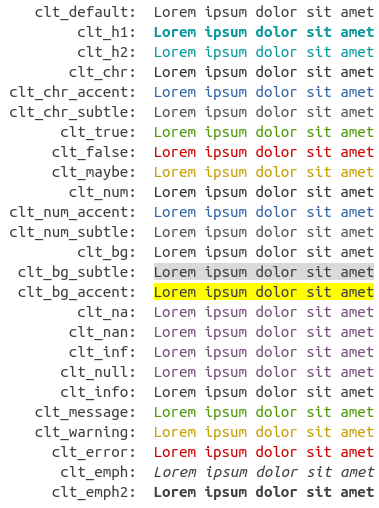
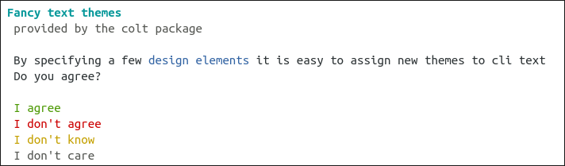
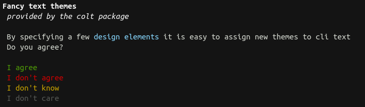

```{r echo = FALSE}
library(colt)
```

# Colt - CLI color themes for R

Colt is aimed at package developers that want to create themeable command line 
output. It is a simple wrapper around the crayon package. 


## Installation

```{r eval = FALSE}
install.packages("colt")
```


## Usage

### Creating a Theme

A colt theme is created with the `colt_theme()` constructor. A colt theme is 
just a list of functions that get applied to the text. A print method exists for 
previewing themes. Colt styles are named semantically rather than directly 
with a color (e.g. "yes" instead of "green").

### Theme Elements

```{r eval = FALSE}
print(clt_theme_light)
```


### Setting themes

The acitive theme is stored in `options("colt.theme")`. It can easily be changed
with `colt::set_theme()`. Colt comes with two default themes, `colt_theme_light`
and `colt_theme_dark`.

```{r}
fancy <- function(x) {cat(
  colt::clt_h1("Fancy text themes\n"),
  colt::clt_h2("provided by the colt package\n\n"),
  colt::clt_chr("By specifying a few"), clt_chr_accent("design elements"), 
  clt_chr("it is easy to assign new themes to cli text\n"),
  colt::clt_chr("Do you agree?\n\n"),
  colt::clt_true("I agree\n"),
  colt::clt_false("I don't agree\n"),
  colt::clt_maybe("I don't know\n"),
  colt::clt_chr_subtle("I don't care\n")
)}
```

#### `colt_theme_light`
```{r eval = FALSE}
colt::set_theme(colt::clt_theme_light)
fancy()

```



#### `colt_theme_dark`
```{r eval = FALSE}
colt::set_theme(colt::clt_theme_dark)
fancy()
```



You can use `colt::set_theme(colt::colt_theme())` to set an empty theme 
(= switch off colors).
