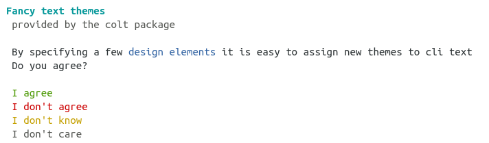
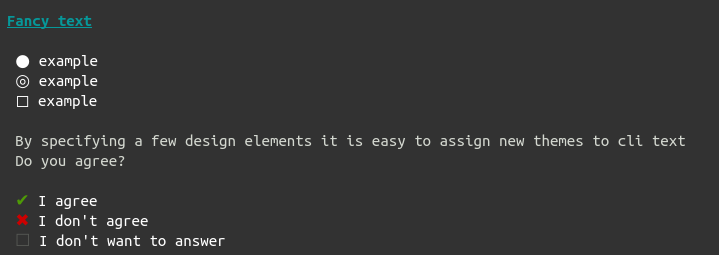
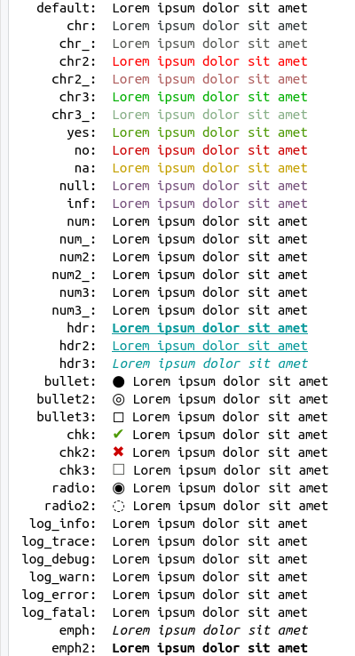

---
output:
  md_document:
    variant: markdown_github
---

```{r}
library(colt)
```
## Colt - CLI color themes for R

Colt provides a wrapper around crayon for themable cli elements. The motivation 
behind this was that it is hard to create color styles that work well on dark 
as well as light consoles.

## Using colt styles

```{r}
fancy <- function(x) {cat(
  colt::clt_h1("Fancy text themes\n"),
  colt::clt_chr_subtle("provided by the colt package\n\n"),
  colt::clt_chr("By specifying a few"), clt_chr_accent("design elements"), clt_chr("it is easy to assign new themes to cli text\n"),
  colt::clt_chr("Do you agree?\n\n"),
  colt::clt_true("I agree\n"),
  colt::clt_false("I don't agree\n"),
  colt::clt_maybe("I don't know\n"),
  colt::clt_chr_subtle("I don't care\n")
)}
```

## Changing the Theme

The acitive theme is stored in `options("colt.theme")`. It can easily be changed
with `colt::set_theme()`. 

### Readable theme for a light console
```{r eval = FALSE}
colt::set_theme(colt_light)
fancy()
```



### Readable theme for a dark console
```{r eval = FALSE}
colt::set_theme(colt_dark)
fancy()
```



## Theme element names (subject to change)

A colt theme is created with the `colt_theme()` constructor. It is just a list 
of functions that get applied to the text. A print method exists for previewing.
Colt styles are named semantically rather than directly with a color 
(e.g. "yes" instead of "green").

```{r eval = FALSE}
names(colt_light)
cat("\n\n")
print(colt_light)
```

